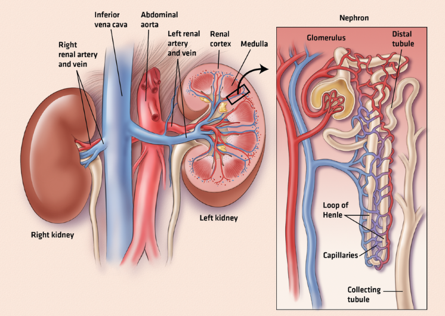

# Predicting CKD
### Author: Andrea Hobby, MS



## Table of Contents
1. [Background](#background)
2. [Goals](#goals)
3. [Data Collection and Data Cleaning](#DataCollectionandDataCleaning)
4. [Feature Selection](#FeatureSelection)
5. [Modeling](#modeling)
6. [Results](#Results)
7. [Final Thoughts](#FinalThoughts)
8. [Next Steps](#NextSteps)
9. [References](#References)
10. [Repo Structure](#repo)


<a name="background"/>

## Background
Chronic kidney disease (CKD) is when the kidneys are damaged and cannot correctly filter waste and excess fluids from the blood. About 37 million people in the United States have Chronic Kidney Disease (CKD). Early detection and diagnosis of CKD are essential to preventing its progression to kidney failure. Machine learning models can assist in predicting CKD. A decision tree will be used to analyze National Center for Health Statistics (NCHS) data for this project. Variables such as age, gender, medical history, and laboratory test results will be used. By identifying patterns in the data, models can predict a patient's risk of developing CKD, allowing for early intervention and management. 

<a name="goals"/>

## Goal(s)
- My goal for this analysis is to predict the risk of CKD. 
- Identify factors that increase the risk of CKD. 

<a name="DataCollectionandDataCleaning"/>

## Data Collection and Data Cleaning
There are 34 columns and 8819 rows in this dataset from NCHS. The data is from adults 20 years of age or older. 
The data was collected from the 1999 to 2000 and 2001 to 2002 NCHS surveys.

I used the pandas library to read the data from the JuypterNotebook.  I could check variable types, identify outliers and null values, and check for duplicates and class imbalance.

### Data science pipeline 
- Data
-- CSV File
- Processing
-- Jupyter Notebook
-- Pandas
-- NumPy
- Modeling
-- Sklean
- Data Visualization
-- Matplotlib

<a name="FeatureSelection"/>

## Feature Selection
First the data was split into the train/test set. Then, I ranked the features in the training set. Based on the feature ranking, I chose the top xx variables to be in the model. 

<a name="modeling"/>

## Modeling
After completeing the exploratory data analysis, I concluded that a classification decision tree would best to predict CKD. 

### Discuss hyperparameter tuning 

<a name="Results"/>

## Results
### Discuss Model Evaluation

<a name="FinalThoughts"/>

## Final Thoughts
Since I chose to create categorical variables from some of the continious variables, it is possible that I lost some information and decreased accuracy. 

<a name="NextSteps"/>

## Next Steps
I would combine this with another dataset for a more robust analysis or try machine learning algorithms like logistic regression or a neural network for the next steps. Also, I would build a web app with a user interface for this model. 

<a name="References"/>

## References
Kidney Disease Statistics for the United States. National Institute of Diabetes and Digestive and Kidney Diseases. U.S. Department of Health and Human Services. Available at: https://www.niddk.nih.gov/health-information/health-statistics/kidney-disease (Accessed: February 22, 2023). 

<a name="repo"/>

## Repo Structure
```
├── /data (data)
├── /img (contains all images for repo)
├── Predicting Chronic Kidney Disease.ipynb
└── README.md

